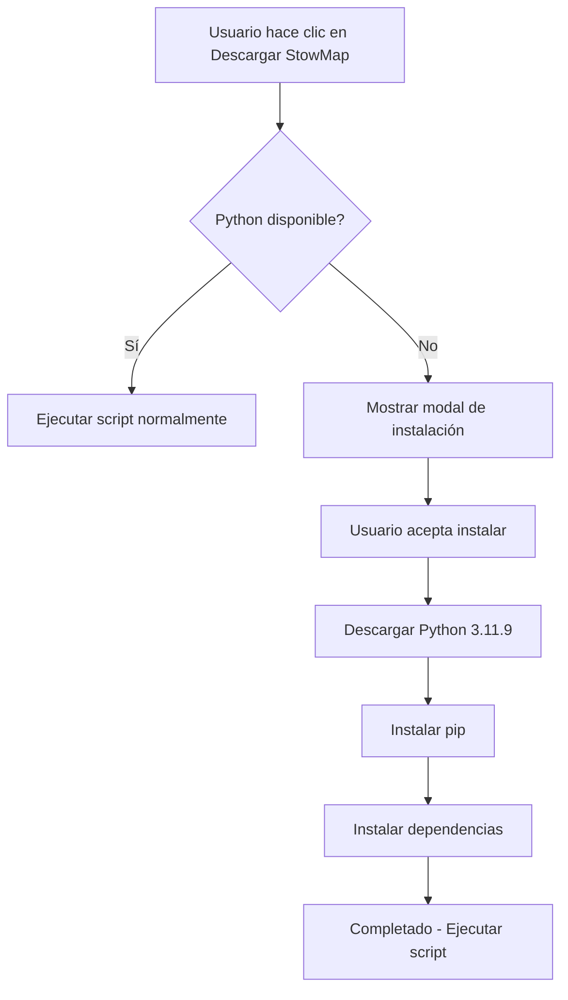

# Python Portable - Guía de Configuración

## 📋 Resumen

IB_Scope ahora incluye soporte para Python portable integrado, eliminando la necesidad de que los usuarios instalen Python manualmente.

## 🚀 Características

- ✅ **Instalación automática**: Python se instala bajo demanda cuando el usuario intenta usar SpaceHeatMap
- ✅ **Sin permisos de administrador**: Instalación completamente portable
- ✅ **Aislado del sistema**: No interfiere con otras instalaciones de Python
- ✅ **Dependencias incluidas**: pandas, beautifulsoup4, requests, requests-kerberos, lxml

## 🏗️ Para Desarrolladores

### Descargar Python Portable Manualmente

Si deseas preparar Python portable antes del build:

```bash
npm run prebuild
```

Esto descargará e instalará:
- Python 3.11.9 embeddable (~10 MB)
- pip
- Todas las dependencias necesarias (~50 MB total)

### Build con Python Portable

El comando de build automáticamente ejecuta el prebuild:

```bash
npm run build
```

Para hacer build sin descargar Python nuevamente:

```bash
npm run build:skip-python
```

### Estructura del Proyecto

```
resources/
└── python-portable/          # Python portable (generado automáticamente)
    ├── python.exe
    ├── python311.zip
    ├── Lib/
    │   └── site-packages/   # Dependencias instaladas
    ├── Scripts/
    │   └── pip.exe
    └── requirements.txt
```

## 👥 Para Usuarios Finales

### Uso Transparente

Los usuarios no necesitan hacer nada especial:

1. Abren la aplicación
2. Navegan a SpaceHeatMap
3. Hacen clic en "Descargar StowMap"
4. **SI Python no está instalado**: Se muestra un diálogo automático
5. Hacen clic en "Instalar Python Portable"
6. Python se descarga e instala automáticamente (~60 MB, 2-3 minutos)
7. Pueden usar la funcionalidad normalmente

### Instalación de Python Portable

El proceso de instalación:
- Descarga Python 3.11.9 embeddable
- Instala pip
- Instala dependencias (pandas, requests, beautifulsoup4, etc.)
- Se completa en 2-5 minutos dependiendo de la conexión

### Ubicación de Python

- **Desarrollo**: `<proyecto>/resources/python-portable/`
- **Producción**: `%LOCALAPPDATA%/Programs/Inbound Scope/resources/python-portable/`

## 🔧 Troubleshooting

### Python no se instala correctamente

1. Verificar conexión a internet
2. Verificar que no haya antivirus bloqueando la descarga
3. Intentar nuevamente desde la aplicación

### Script de Python falla

Si Python está instalado pero los scripts fallan:

1. Verificar que las dependencias estén instaladas:
   ```bash
   resources/python-portable/python.exe -m pip list
   ```

2. Reinstalar dependencias manualmente:
   ```bash
   resources/python-portable/python.exe -m pip install -r resources/python-portable/requirements.txt
   ```

### Fallback al Python del sistema

Si Python portable no está disponible, el sistema intentará usar:
1. `python` del sistema
2. `python3` del sistema

## 📝 Notas Técnicas

### Detección de Python

El servicio de Python (`pythonService.js`) implementa la siguiente lógica:

```javascript
1. Verificar si existe Python portable
2. Si no existe, verificar Python del sistema
3. Si ninguno existe, lanzar error PYTHON_NOT_FOUND
4. En el frontend, mostrar diálogo de instalación
```

### IPC Handlers Nuevos

- `check-python`: Verifica disponibilidad de Python
- `install-portable-python`: Instala Python portable con progreso
- `check-python-dependencies`: Verifica dependencias instaladas
- `python-install-progress`: Stream de progreso de instalación

## 🔐 Seguridad

- Python portable se descarga desde python.org oficial
- get-pip.py se descarga desde bootstrap.pypa.io oficial
- Todas las dependencias se instalan desde PyPI
- No se requieren permisos elevados
- Instalación completamente en espacio de usuario

## 📦 Dependencias de Python Incluidas

```
pandas>=2.0.0
beautifulsoup4>=4.12.0
requests>=2.31.0
requests-kerberos>=0.14.0
lxml>=4.9.0
```

## 🎯 Flujo de Usuario



## ✅ Checklist de Implementación

- [x] Servicio de Python portable (pythonService.js)
- [x] Script de descarga automatizado (download-python.js)
- [x] IPC handlers para verificación e instalación
- [x] UI modal para instalación de Python
- [x] Verificación automática antes de ejecutar scripts
- [x] Configuración de build para incluir Python portable
- [x] Fallback a Python del sistema si existe
- [x] Manejo de errores y progreso de instalación

