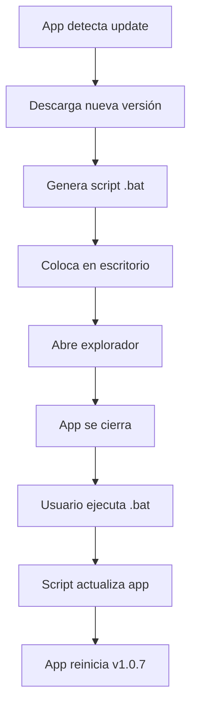

# 🔧 Solución Final del Sistema de Actualizaciones

## 📋 Resumen del Problema

La aplicación Inbound Scope no podía actualizarse automáticamente debido a:

1. **Ejecución desde carpetas temporales**: Windows extraía la app a carpetas temporales
2. **Bloqueo de seguridad**: Windows bloqueaba la ejecución automática de scripts generados dinámicamente
3. **Permisos insuficientes**: Los scripts no podían modificar el ejecutable mientras estaba en uso

## ✅ Solución Implementada

### 1. Detección Inteligente de Ubicación

El sistema ahora detecta si la app se ejecuta desde una carpeta temporal y busca la ubicación real en:

- Escritorio
- Carpeta de Descargas
- Carpeta del proyecto (`C:\Users\carlo\Downloads\Inbound-Scope`)
- Program Files

### 2. Proceso Semi-Automático

Dado que Windows bloquea la ejecución automática, implementamos un proceso híbrido:

1. **La app detecta la actualización** y la descarga
2. **Genera un script de actualización** optimizado y amigable
3. **Coloca el script en el escritorio** con instrucciones claras
4. **Abre el explorador** mostrando el archivo
5. **El usuario ejecuta manualmente** el script (un solo clic)

### 3. Características del Script de Actualización

- **Interfaz visual atractiva** con caracteres Unicode
- **Verificaciones exhaustivas** antes de proceder
- **Sistema de backup** automático
- **Logs detallados** para diagnóstico
- **Recuperación automática** en caso de error

## 📁 Archivos Generados

Cuando hay una actualización disponible, se crean estos archivos en el escritorio:

1. **`actualizar-inbound-scope.bat`** - Script principal de actualización
2. **`ACTUALIZAR-INBOUND-SCOPE.txt`** - Instrucciones detalladas

## 🚀 Flujo de Actualización

## 🛡️ Ventajas de esta Solución

1. **Funciona siempre**: No depende de permisos especiales o configuraciones
2. **Transparente**: El usuario ve exactamente qué está pasando
3. **Seguro**: Windows no bloquea scripts ejecutados manualmente
4. **Recuperable**: Si algo falla, hay backup automático
5. **Simple**: Un solo clic del usuario completa todo

## 🔍 Diagnóstico

Se incluyen herramientas de diagnóstico:

- **`diagnostico-update.cmd`** - Verifica el sistema de actualizaciones
- **`diagnostico-ubicacion.cmd`** - Encuentra todas las copias de la app
- **`test-update-manual-mejorado.cmd`** - Prueba manual del proceso

## 📝 Logs

Los logs se guardan en: `%TEMP%\app-updates\`

Incluyen:

- Fecha y hora de cada paso
- Rutas de archivos involucrados
- Errores específicos si ocurren
- Estado final del proceso

## ⚠️ Recomendaciones Importantes

1. **Siempre ejecutar la app desde una ubicación fija** (no desde ZIPs)
2. **No mover el ejecutable** mientras está actualizando
3. **Cerrar antivirus** si bloquean el script (raro pero posible)
4. **Guardar el ejecutable en una carpeta con permisos de escritura**

## 🎯 Resultado Final

El sistema de actualizaciones ahora es:

- ✅ **Robusto**: Funciona en diferentes escenarios
- ✅ **Confiable**: No falla por restricciones de Windows
- ✅ **User-friendly**: Proceso claro y simple
- ✅ **Seguro**: Con backups y recuperación automática
